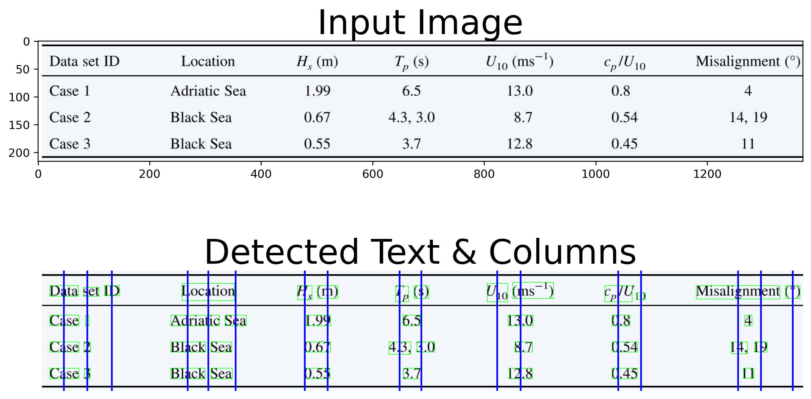
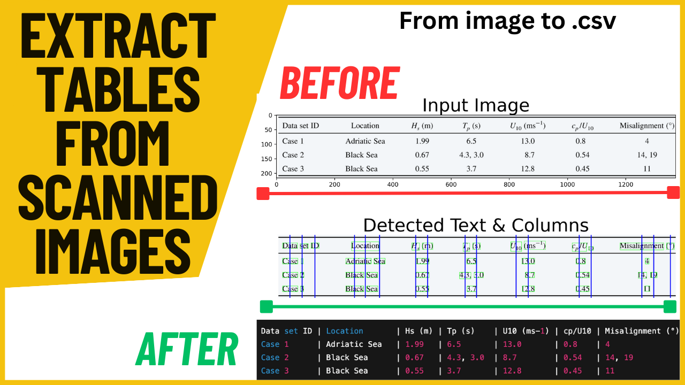

# Table Extraction from Images (No Grid Lines)

Extract structured tables from **scanned pages, textbook photos, screenshots, and PDFs-as-images** — even when the table has **no vertical/horizontal borders**.

Most “table OCR” approaches depend on visible grid lines (or perfect PDF text). In real documents, tables are often just **aligned text**, which causes common failures:
- units like `(m)` or `(s)` are misread as their own columns  
- headers are split across multiple OCR boxes (`Data | set | ID`)  
- multi-word cells split into multiple columns (`Black | Sea`)  
- values split across columns (`14, | 19`)  

This project solves that by using **OCR text geometry + spatial clustering**, then applying **semantic cleanup** to remove false columns and merge split content into the correct cells. Everything runs locally (free), using Tesseract OCR.

---

## Example Output (Debug View)

The debug figure shows:
- detected OCR word boxes (**green**)
- inferred column boundaries (**red**)



---

## How it works (high level)

1. **OCR** the image using Tesseract (`image_to_data`) to get each word + bounding box.
2. **Row grouping**: cluster words into rows using vertical proximity (`row_tol`).
3. **Column inference**: cluster x-centers into column centers using horizontal tolerance (`col_tol`).
4. **Grid reconstruction**: assign each word to its nearest inferred column and join tokens per cell.
5. **Semantic cleanup**:
   - drop “fake” columns (units-only / header-only / empty columns)
   - merge split text columns (e.g., `Black` + `Sea` → `Black Sea`)
6. **Export**: save the cleaned table to CSV + save a debug figure for verification.

---

## Features

- Works on tables **without grid lines**
- Handles scans / phone photos / screenshots
- Removes false columns (units, punctuation, empty columns)
- Merges split columns for multi-word cells
- Saves a cleaned CSV + debug visualization
- Fully offline (no paid APIs)

---

## Installation

Requirements:
- Python 3.8+
- Tesseract OCR installed (system)

Python deps:
```bash
pip install opencv-python pytesseract pandas numpy matplotlib

```

### Clone the repository
```bash
git clone https://github.com/akaawase-bernard/Table-Extraction-from-Images.git
cd Table-Extraction-from-Images

python table_extraction.py
```



## Video Walkthrough

The implementation details, and example results is available here:
🎥 https://youtu.be/hykPp8wBebY

